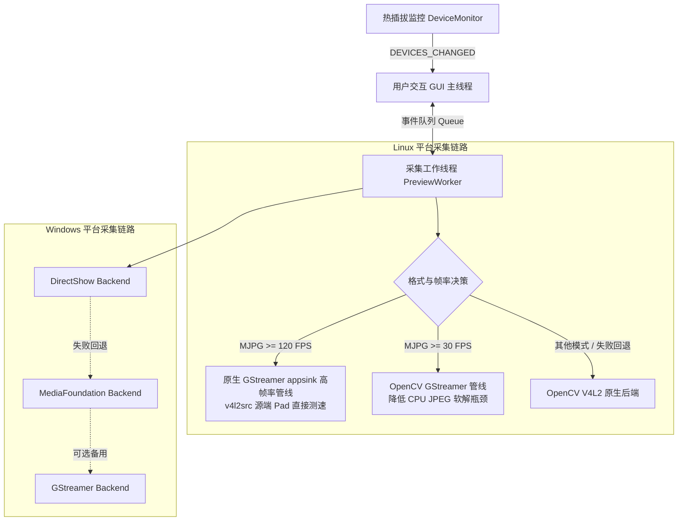

# CamBench

CamBench 是一个面向 Linux 与 Windows 的轻量级跨平台摄像头实时采集、帧率（FPS）评测与硬件能力诊断工具。基于 Python、Tkinter 与 OpenCV 构建，在 Linux 深度集成 V4L2 原生 ioctl 与 GStreamer 硬件/多线程解码管线，在 Windows 支持 DirectShow 与 MediaFoundation 双后端。

用于解决 UVC 摄像头实际采集帧率与厂商标称不符、模式参数不透明、高分辨率/高帧率掉帧以及硬件瓶颈定位困难等实际问题。

---

## 为什么使用 CamBench？

- **实测真帧率，拒绝显示端限速**：采集工作线程与 GUI 预览完全解耦。对于 `>=120 FPS` 的超高帧率模式，直接在 GStreamer `v4l2src` 源端统计瞬时与累计帧率，不被界面刷新率（30 FPS）拖慢。
- **硬件能力全景矩阵**：一键打开「📋 硬件能力清单」，支持按格式、分辨率、帧率多列排序，双击任意一行立即装载。
- **三级联动与无感热切换**：「编码格式 -> 分辨率 -> 目标帧率」分级联动筛选；在画面预览运行中修改参数，系统自动平滑重启采集管线，无需反复启停。
- **热插拔自动感知**：后台监听硬件事件（Linux 支持 `pyudev` netlink 与 sysfs 轮询；Windows 动态检测设备拓扑），设备插入自动识别装载，意外拔出安全防护并弹窗提醒。
- **一键硬件瓶颈诊断**：实测 FPS 偏低（<70% 标称帧率）自动触发警示，一键排查自动曝光长曝光限制、USB 2.0/3.0 接口带宽瓶颈与系统内核驱动告警。

---

## 快速开始 (Quick Start)

### 1. 安装依赖

#### Linux (Ubuntu / Debian)

```bash
sudo apt update && sudo apt install -y \
    python3-tk python3-opencv python3-numpy \
    python3-gi gir1.2-gstreamer-1.0 v4l-utils python3-pyudev \
    gstreamer1.0-tools gstreamer1.0-plugins-base \
    gstreamer1.0-plugins-good gstreamer1.0-plugins-bad \
    gstreamer1.0-libav
```

> **说明**：
> - `python3-pyudev` 用于提供即时 netlink 热插拔感知（未安装时会自动降级为 sysfs 轮询）。
> - `v4l-utils` 提供 `v4l2-ctl` 工具与节点过滤辅助（未安装时优先通过 V4L2 原生 ioctl 枚举）。

#### Windows

需要 Python 3.8+（官方安装包默认已包含 Tkinter）：

```powershell
pip install opencv-python numpy
```

---

### 2. 运行程序

在仓库根目录直接运行：

```bash
# Linux
python3 main.py

# Windows
python main.py
```

---

## 使用指南

### 典型操作流程

1. **选择摄像头**：
   - 启动后自动扫描接入的摄像头；
   - Linux 自动过滤非 Video Capture 元数据节点，并将同一物理相机的多节点合并显示；
   - Windows 自动探测索引并调用 PowerShell 获取设备友好名称；
   - 随时插入新相机即可自动更新下拉框，亦可点击「🔄 刷新」手动同步。
2. **配置采集模式**：
   - **方式 A（分级联动）**：依次在下拉框选择「编码格式」（如 `MJPG` / `YUY2`） -> 「分辨率」 -> 「目标帧率」。
   - **方式 B（硬件能力清单）**：点击「📋 硬件能力清单」，在弹出表格中浏览该设备支持的全部模式，点击列头可排序，**双击目标行**直接装载对应参数。
3. **启动预览与观察指标**：
   - 点击「启动」按钮开启实时采集（启动后按钮变为「停止」）；
   - 可勾选「镜像」切换画面的水平翻转；
   - 运行过程中可任意调整下拉框参数，采集管线将自动无感平滑切换。
4. **瓶颈排查**：
   - 当实测帧率持续低于标称值的 70% 时，界面会弹出黄色提示；
   - 点击「诊断」按钮即可弹出硬件诊断报告。

### 实时参数面板说明

主界面左下方紧凑显示 11 项核心运行指标：

| 指标名 | 字段含义 | 说明 |
| :--- | :--- | :--- |
| **设备** (`device`) | 当前采集设备标识 | Linux 下为 `/dev/video*`，Windows 下为设备索引编号 |
| **画面** (`preview`) | 画面预览状态 | 正常显示时为 `已开启`，无画面时显示 `无帧` |
| **后端** (`backend`) | 底层采集后端 | 如 `OpenCV V4L2 /dev/video0`、`GStreamer`、`DirectShow 0` 等 |
| **格式** (`format`) | 当前生效像素编码 | 如 `MJPG`、`YUY2`（V4L2 的 `YUYV` 自动归一化为 `YUY2`） |
| **请求** (`requested_size`) | 用户选定的目标分辨率 | 如 `1920x1080` |
| **实际** (`actual_size`) | 驱动协商生效的实际分辨率 | 确认底层驱动是否按请求分辨率正确协商 |
| **标称** (`target_fps`) | 目标标称帧率 | 用户请求的帧率设定值（FPS） |
| **实时** (`realtime_fps`) | 滚动窗口瞬时帧率 | 基于滑动时间戳窗口计算的实时 FPS（高亮绿色显示） |
| **平均** (`avg_fps`) | 累计平均帧率 | 本次采集启动以来的全程平均 FPS |
| **帧数** (`frames`) | 累计捕获帧数 | 本次采集成功接收的有效帧总量 |
| **运行** (`elapsed`) | 累计运行时长 | 采集已持续的时间（秒） |

---

## 系统配置说明

系统核心配置定义在 `core.py` 中，用户可按需微调常量：

| 配置变量 | 默认值 | 类型 | 功能说明 |
| :--- | :--- | :--- | :--- |
| `SUPPORTED_FORMATS` | `{"MJPG", "YUYV", "YUY2"}` | `set` | 支持枚举与采集的目标图像编码格式 |
| `PREVIEW_UPDATE_FPS` | `30` | `int` | GUI 画面预览重绘频率上限，防止图像渲染抢占 CPU 影响采集 |
| `STATS_ONLY_UPDATE_FPS` | `10` | `int` | 纯参数更新模式（无画面更新）下的面板刷新频率 |
| `PREVIEW_FPS_HISTORY_SIZE` | `240` | `int` | 滑动窗口大小（帧数），用于平滑计算实时 FPS |
| `LOW_FPS_RATIO_THRESHOLD` | `0.7` | `float` | 实际帧率低于标称帧率该比例（即 <70%）时判定为帧率不足 |
| `LOW_FPS_SUSTAINED_UPDATES` | `15` | `int` | 连续低于阈值多少次采样后在界面触发黄色诊断引导提示 |
| `LOW_FPS_MIN_TARGET` | `30.0` | `float` | 触发低帧率判定所需的最低标称帧率（标称 `<=15 FPS` 不触发误报） |
| `COMMON_FALLBACK_MODES` | 5 组常见模式元组 | `tuple` | 当老旧驱动不支持 V4L2 帧间隔 ioctl 时的通用兜底模式矩阵 |

---

## 采集后端策略与架构设计

### 采集链路架构



### 后端决策逻辑

- **Linux 平台**：
  1. **MJPG 且 FPS >= 120**：强制走原生 GStreamer appsink 管线。直接在 `v4l2src` 节点的 source pad 处统计缓冲帧时间戳，消除 GUI 渲染及 Python 层传输损耗；若管线启动失败，**明确拒绝伪回退至 OpenCV V4L2**，防止底层静默降速掩盖问题。
  2. **MJPG 且 FPS >= 30**：优先使用 GStreamer 管道（支持系统已安装的硬件加速解码器如 Jetson `nvv4l2decoder` 或高效软解），规避 OpenCV 内部传统解码器的 CPU 单核瓶颈。
  3. **其他模式（如 YUY2 或低帧率）**：优先尝试 OpenCV V4L2 后端，失败后再回退到 GStreamer。
- **Windows 平台**：
  1. 优先使用 `DirectShow`（兼容性最好、对离散分辨率/帧率设置响应更直接）；
  2. 若打开或参数协商失败，自动回退到 `MediaFoundation`；
  3. 环境中存在 GStreamer 时可作为最终备选。

---

## 诊断与排查 (Troubleshooting)

当实测 FPS 明显低于相机标称参数时，通常由以下三个物理或配置原因引起：

### 1. 自动曝光导致曝光时间超标（最常见）
- **现象**：标称 60/120 FPS 的相机在室内较暗环境下实测只有 15~30 FPS。
- **原因**：UVC 固件开启了自动曝光或低光补偿，在光照不足时固件会自动拉长单帧曝光时间（例如曝光 40ms 时物理最大帧率不可能超过 25 FPS）。
- **诊断与修复**：
  - **Linux**：点击「诊断」按钮查看当前曝光模式。使用以下命令切换为手动曝光并调整快门：
    ```bash
    # 切换为手动曝光 (1=手动, 3=光圈优先自动)
    v4l2-ctl -d /dev/video0 --set-ctrl=exposure_auto=1
    # 调节绝对曝光时间 (数值越小曝光时间越短，帧率恢复，画面会变暗，需增加环境补光)
    v4l2-ctl -d /dev/video0 --set-ctrl=exposure_absolute=150
    ```
  - **Windows**：打开 Windows 自带的「相机」设置检查是否开启了低光补偿，或通过厂商配置软件切换为手动曝光并提升环境亮度。

### 2. USB 总线带宽限制
- **现象**：在 1080P 或 4K 下选择 `YUY2` 无法跑到 30/60 FPS，或多个摄像头同时开启时频繁丢帧。
- **原因**：`YUY2` 是未压缩格式（1080P@60FPS 原始数据量高达约 2 Gbps），USB 2.0 理论上限仅 480 Mbps，物理带宽无法承载。
- **诊断与修复**：
  - 高分辨率/高帧率下**优先选择 `MJPG` 压缩格式**；
  - 将相机接入主机后置的蓝色 USB 3.0/3.1 接口，避免经由低速 USB Hub 扩展坞。

### 3. Linux 设备权限或节点占用
- **现象**：启动失败，提示无法打开 `/dev/video*`。
- **排查**：检查当前用户是否有视频设备访问权限：
  ```bash
  sudo usermod -aG video $USER
  # 重新登录或执行 newgrp video 生效
  ```

---

## 项目结构

```text
CamBench/
├── main.py                  # 应用程序主入口，启动 GUI 主循环与异常捕获
├── core.py                  # 核心常量配置、跨线程事件数据模型与日志封装
├── app/                     # UI 层 (Tkinter)
│   ├── application.py       # 主窗口控制器、事件轮询调度、三级联动逻辑
│   ├── widgets.py           # 硬件能力矩阵表格窗口、紧凑双列实时参数面板
│   └── styles.py            # 主题样式与色彩配置
├── camera/                  # 采集与设备驱动层
│   ├── models.py            # CameraMode 与 CameraInfo 结构定义
│   ├── scanner.py           # 设备枚举（V4L2 / Windows 扫描与节点合并）
│   ├── capture.py           # 采集器封装与后端调度策略（V4L2/GStreamer/DirectShow）
│   ├── pipeline.py          # GStreamer 管道组装与解码器优先级决策
│   ├── modes.py             # 模式解析、ioctl 分辨率/帧率枚举与三级分组
│   ├── monitor.py           # 设备热插拔监听器（pyudev netlink + 轮询）
│   ├── diagnostics.py       # Linux 硬件瓶颈诊断（USB速率/曝光/内核日志）
│   ├── windows_backend.py   # Windows 设备扫描、能力探测与诊断
│   ├── v4l2_io.py           # 原生 V4L2 ioctl 底层接口封装
│   ├── fps.py               # 滑动窗口实时与平均帧率高精度计量器
│   └── utils.py             # 文本解析、格式规范化与外部命令封装
├── workers/                 # 后台工作线程
│   └── preview_worker.py    # 独立读帧工作线程，线程安全事件回传
└── tests/                   # 单元测试套件 (49 tests)
    ├── test_application.py
    ├── test_diagnostics.py
    ├── test_fps.py
    ├── test_modes.py
    ├── test_monitor.py
    ├── test_v4l2_io.py
    └── test_windows.py
```

---

## 单元测试

项目内置完整的单元测试覆盖（包括模式枚举、FPS 计量、设备监控、V4L2 解析与 Windows 后端等）：

```bash
python3 -m unittest discover -s tests
```

---

## 许可证

本项目代码目前未附加开放源代码许可证。请保留代码原作者署名，未经许可请勿默认作为可商用再分发项目。
